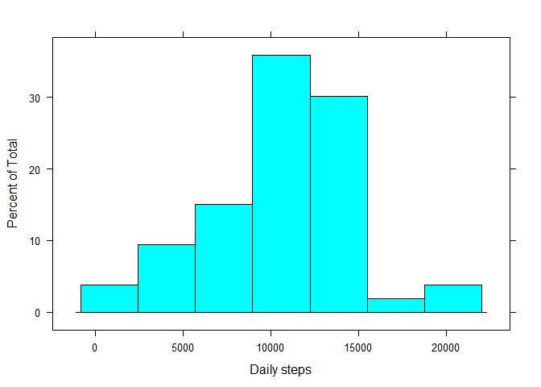
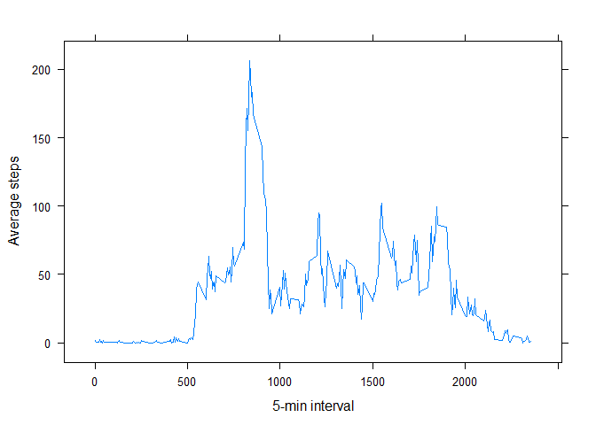
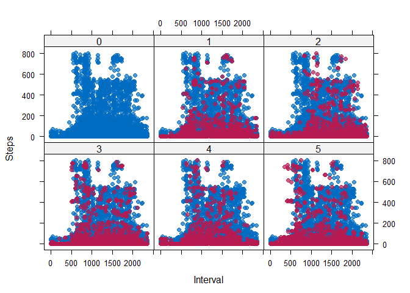
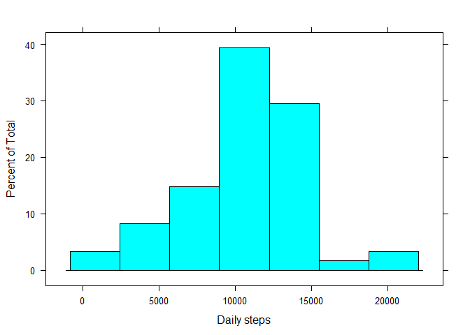
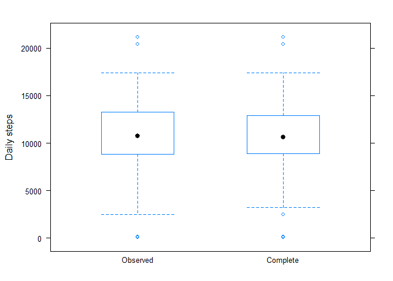
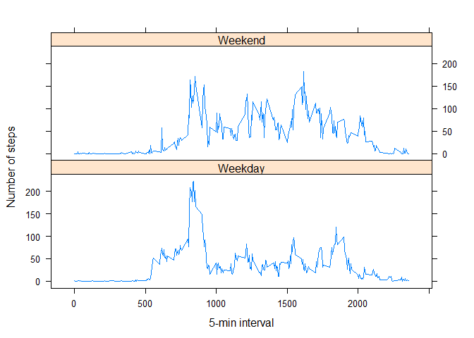

# Reproducible Research: Peer Assessment 1


## Loading and preprocessing the data


```r
x <- {
  data.file <- "activity.csv"
  if (!file.exists(data.file)) { unzip("activity.zip") }
  read.csv(data.file)
}
```


## What is mean total number of steps taken per day?
  

```r
require("lattice")
steps.per.day <- with(aggregate(steps ~ date, x, sum), {
  list(
    plot = histogram(steps, xlab = "Daily steps"),
    mean = mean(steps, na.rm = TRUE),
    median = median(steps, na.rm = TRUE),
    examples = length(steps)
  )
})
```

Following is the total number of daily steps as a histogram. The `steps` data
comprises around 13% and any day
with incomplete data is omitted from this distribution.


```r
print(steps.per.day$plot)
```

<!-- -->

The distribution of total daily steps has a mean of
10766.2 and a median of
10765.

## What is the average daily activity pattern?


```r
require("lattice")
average.daily.pattern <- with(aggregate(steps ~ interval, x, mean), {
  list(
    plot = xyplot(
      steps ~ interval,
      type = "l",
      xlab = "5-min interval", ylab = "Average steps"),
    max.interval = interval[which.max(steps)]
  )
})
```

Below is the average number of steps that occurs at each 5-minute interval,
which represents the daily average activity profile.


```r
print(average.daily.pattern$plot)
```

<!-- -->

The maximum average daily activity corresponds to the `interval` value
835. This presumably corresponds to the
period 8:35AM to 8:40AM and to a morning commute.

## Imputing missing values


```r
require("mice")
require("knitr")
missing.values <- md.pattern(x)
kable(missing.values)
```

         date   interval   steps       
------  -----  ---------  ------  -----
15264       1          1       1      0
2304        1          1       0      1
            0          0    2304   2304

The above table shows that the only column that contains missing data is
`steps`. This results in 2304 incomplete observations, which
represents about 13% of the total
observations.

Use MICE [@JSSv045i03, pp. 7-15] to perform the imputation, based entirely on
the `interval` value.


```r
require("mice")
require("lattice")
imputed <- {
  imp <- mice(
      x, seed = 400,
      predictorMatrix = matrix(c(0, 0, 0, 0, 0, 0, 1, 0, 0), nrow = 3),
      print = FALSE)
  list(
    plot.vs.obs = xyplot(
      imp,
      steps ~ interval | .imp,
      pch = 20, cex = 1.4,
      xlab = "Interval", ylab = "Steps"),
    complete = complete(imp))
}
```

To check that the imputation gives realistic values, the following shows the
distribution of observed and imputed data across five imputations.


```r
print(imputed$plot.vs.obs)
```

<!-- -->

The suggests that the imputation is sensible. Based on the complete data (with
imputed values), the following shows the total number of daily steps as a
histogram.


```r
require("lattice")
complete.steps.per.day <- with(aggregate(steps ~ date, imputed$complete, sum), {
  print(histogram(steps, xlab = "Daily steps"))
  list(
    mean = mean(steps),
    median = median(steps),
    examples = length(steps)
  )
})
```

<!-- -->

With imputed values, the distribution of total daily steps has a mean of
10771.3 and a median of
10630. There is no significant difference between
these values and those that were calculated based only on observed data.

To look at the  impact of imputing data on the total daily number of steps, the
following shows the distributions of observed and complete (with imputation)
total daily steps.


```r
require("lattice")
with(
  aggregate(
    steps ~ date + source,
    rbind(
      cbind(x, source = "Observed"),
      cbind(imputed$complete, source = "Complete")),
    sum),
  print(bwplot(steps ~ source, ylab = "Daily steps"))
)
```

<!-- -->

The above analysis shows that whilst the number of daily totals using imputed
data is 61 rather than
53 based only on observed data, the distribution of
these examples remains basically unchanged. This is exactly that we would hope.

## Are there differences in activity patterns between weekdays and weekends?

The following plot shows the respective average daily activity profile for
weekdays and weekend-days.


```r
require("lattice")
{
  is_weekend <- function(date) { weekdays(date) %in% c("Saturday", "Sunday") }
  complete <- cbind(
      imputed$complete,
      day = ifelse(
        is_weekend(as.Date(imputed$complete$date, format = "%Y-%m-%d")),
        "Weekend", "Weekday"))

  with(aggregate(steps ~ interval + day, complete, mean), {
    print(xyplot(
      steps ~ interval | day,
      type = "l",
      layout = c(1, 2),
      xlab = "5-min interval", ylab = "Number of steps"))
  })
}
```

<!-- -->

The above activity profiles are averaged over a relatively small sample of days
and so are subject to noise, but a more-peaky distribution can be seen on a
weekday. Although the weekend profile still has a comparably peak in the
morning, the distribution is generally flatter and less well defined.

# References
